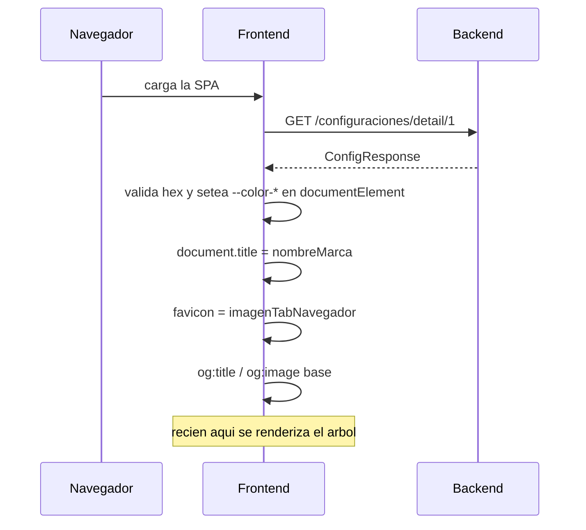

# Flujo 01 — Bootstrap / Configuracion de marca (white-label)

Es el **primer request de la app**, antes de renderizar nada. Lo dispara `ColorConfigProvider`
(`src/context/ColorContext.tsx:110-113`) montado en la raiz. De su respuesta salen los colores,
el logo del header y del footer, los datos de contacto, las redes sociales, el favicon,
el `<title>` y las URLs de los documentos legales.



---

## `GET /configuraciones/detail/1`

- **Auth:** no requiere. Se manda `Authorization` solo si ya hubiera token en storage.
- **Cuando:** una vez al montar la app. Se puede repetir con `reloadConfig()`.
- **Request body:** ninguno. **Query params:** ninguno.
- **El `1` esta hardcodeado** en la ruta (`ColorContext.tsx:92`) — es la configuracion unica del tenant.

### Response body

```jsonc
{
  "id": 1,
  "dominio": "https://taquillavip.com",
  "nombreMarca": "TaquillaVip",

  // --- Colores de marca (hex #RGB o #RRGGBB). Si uno es invalido se usa el default ---
  "enfasis":    "#082348",   // -> --color-emphasis     / tailwind `emphasis`
  "acentoBase": "#023E8A",   // -> --color-accent-base  / tailwind `accentBase`
  "acentoBajo": "#3B82F6",   // -> --color-accent-light / tailwind `accentLight`
  "neutro":     "#f4f4ff",   // -> --color-neutral      / tailwind `neutral`
  "fondo":      "#27272A",   // -> --color-darker       / tailwind `darker`

  // --- Imagenes ---
  "logo": "https://cdn/.../logo.png",              // fallback de og:image
  "logoMarca": "https://cdn/.../logo-marca.png",   // header y footer
  "logoSmall": "https://cdn/.../logo-sm.png",      // header compacto
  "imagenTabNavegador": "https://cdn/.../fav.png", // favicon
  "imagenCompartir": "https://cdn/.../og.png",     // og:image preferido

  // --- Footer: contacto ---
  "direccionContacto": "Av. Ejemplo 123, CDMX",
  "emailContacto": "contacto@taquillavip.com",
  "telefonoContacto": "+52 55 1234 5678",
  "mensajeFooter": "Todos los derechos reservados",

  // --- Footer: redes (cada una se oculta si viene vacia) ---
  "urlFacebook": "https://facebook.com/...",
  "urlInstagram": "https://instagram.com/...",
  "urlTwitter": "https://x.com/...",

  // --- Legales: URLs absolutas a documentos .docx / .html ---
  "terminosYCondiciones": "https://cdn/.../terminos.docx",
  "avisoPrivacidad": "https://cdn/.../aviso.docx",
  "politicasDeUso": "https://cdn/.../politicas.docx",

  // --- Feature flags y textos ---
  "habilitarConferencias": true,   // muestra/oculta el modulo cosmotech
  "mostrarOjo": true,
  "botonTexto": "Comprar",
  "botonIcono": "ticket",
  "titulo": "...",
  "rutaBase": "...",
  "descripcion": "Compra boletos para conciertos...",   // meta description
  "descripcionMarca": "..."                              // fallback de descripcion
}
```

> La interfaz `ConfigResponse` (`ColorContext.tsx:12-24`) declara `[key: string]: any`, asi que
> el backend puede agregar campos sin romper el build. Los campos listados arriba son los que
> el front **realmente consume** hoy.

### Que hace el front con la respuesta

| Campo | Efecto |
|---|---|
| `enfasis` / `acentoBase` / `acentoBajo` / `neutro` / `fondo` | Valida contra `/^#([0-9A-F]{3}){1,2}$/i`. Si pasa, se setea la CSS var; si no, se usa el default. |
| `nombreMarca` | `document.title` + `og:title` base |
| `imagenTabNavegador` | reemplaza `<link rel="icon">` |
| `imagenCompartir` ?? `logo` | `og:image` base |
| `descripcion` ?? `descripcionMarca` | `meta[name=description]` + `og:description` |
| `logoMarca` | `` del navbar y del footer |
| `logoSmall` | logo del navbar en viewport reducido |
| `habilitarConferencias` | condiciona el acceso al modulo de conferencias |
| `urlFacebook` / `urlInstagram` / `urlTwitter` | cada bloque social se renderiza **solo si el campo tiene valor** |
| `direccionContacto` / `emailContacto` / `telefonoContacto` | bloque de contacto del footer, tambien condicional |
| `mensajeFooter` | linea de copyright |

**Defaults si el endpoint falla** (`ColorContext.tsx:104-108`): se aplican los colores
por defecto (`#082348`, `#023E8A`, `#3B82F6`, `#f4f4ff`, `#27272A`), `config` queda en `null`
— el footer y el logo simplemente no se pintan — y se guarda `error: "No se pudo cargar la configuracion"`.
La app **no se bloquea**.

---

## Paginas legales — descarga directa del documento

Las 4 vistas bajo `/legales/*` no llaman al backend propio: hacen `fetch()` a la **URL absoluta**
que vino en la config y renderizan el `.docx` con `mammoth` + `dompurify`.

| Ruta | Campo de config que consume |
|---|---|
| `/legales/terminos_y_condiciones` | `terminosYCondiciones` |
| `/legales/aviso_de_privacidad` | `avisoPrivacidad` |
| `/legales/nuestras_politicas` | `politicasDeUso` |
| `/legales/eliminacion_de_cuenta` | (estatica, sin fetch) |

`src/eventos/pages/legales/TerminosCondiciones.tsx:17-29`

> **Requisito de infraestructura:** esas URLs deben servirse con CORS abierto al dominio del front,
> porque el navegador las descarga directamente.
