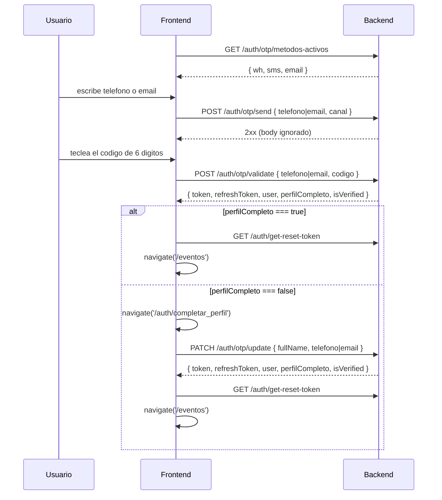

# Flujo 02 — Autenticacion

Hoy el **unico flujo alcanzable desde la UI es el de OTP** (codigo de 6 digitos por
WhatsApp / SMS / email). El login por email+password y el registro siguen implementados
en `useAuthStore` pero la ruta `/auth/register` esta comentada (`router.tsx:181`) y ningun
componente llama a `startLogin`. Google y Apple tambien estan implementados y **sin consumidores**.

---

## 2.1 Login por OTP (flujo vivo)



### `GET /auth/otp/metodos-activos`

Se llama al montar el formulario de login. Decide que canales se muestran.

- **Auth:** no requiere. **Body:** ninguno.

```jsonc
// Response
{ "wh": true, "sms": false, "email": true }
```

| Campo | Efecto en la UI |
|---|---|
| `wh` | habilita el canal WhatsApp |
| `sms` | habilita el canal SMS |
| `email` | habilita la pestaña de correo |

Pestaña por defecto: `telefono` si `wh || sms`, si no `email`. El selector telefono/email
solo se pinta cuando `(wh || sms) && email`.

**Si falla:** no muestra alerta, usa el fallback hardcodeado `{ wh: true, sms: false, email: false }`.

---

### `POST /auth/otp/send` y `POST /auth/otp/resend`

Mismo contrato exacto. `resend` tiene cooldown de 30 s en el cliente.

- **Auth:** no requiere (estan en `SKIP_REFRESH_URLS`).

```jsonc
// Request — canal === "email"
{ "email": "usuario@dominio.com", "canal": "email" }
```

```jsonc
// Request — canal === "whatsapp" | "sms"
{ "telefono": "+525512345678", "canal": "whatsapp" }
```

`telefono` va en **E.164**, construido como `+{dialCode}{digitos}` (default MX, `src/data/countryCodes.ts`).
`email` va con `.trim()`.

- **Response:** el body **no se lee**. Solo importa el status 2xx.

**Comportamiento especial:** si `resend` sobre `sms` responde "service unavailable"
(503 o el patron descrito en [convenciones](./00-convenciones.md)), el front **reintenta
automaticamente** con `canal: "whatsapp"`.

---

### `POST /auth/otp/validate`

- **Auth:** no requiere. Ojo: aqui **`canal` ya NO se manda**.

```jsonc
// Request — email
{ "email": "usuario@dominio.com", "codigo": "123456" }
```

```jsonc
// Request — telefono
{ "telefono": "+525512345678", "codigo": "123456" }
```

```jsonc
// Response
{
  "token": "eyJhbGciOi...",
  "refreshToken": "eyJhbGciOi...",
  "user": {
    "email": "usuario@dominio.com",
    "fullName": "Juan Perez",
    "isActive": true,
    "roles": ["user"],
    "deleted": 0,
    "telefono": "+525512345678"
  },
  "perfilCompleto": true,
  "isVerified": true
}
```

`token` es obligatorio. `refreshToken` puede venir `null`.

**Al exito:**
1. Persiste `token` y `resetToken` segun el check "Mantener sesion iniciada"
   (`true` → `localStorage` + `keepSession="1"`; `false` → `sessionStorage`).
2. `dispatch(onLogin({ user: {...user, perfilCompleto}, token, isVerified }))`.
3. Si `perfilCompleto === true` → `GET /auth/get-reset-token` y navega a `/eventos`.
4. Si `perfilCompleto === false` → navega a `/auth/completar_perfil`. **Es bloqueante**: mientras
   `user.perfilCompleto === false`, `App.tsx` redirige cualquier ruta a esa pagina.

---

### `PATCH /auth/otp/update` — completar perfil

- **Auth:** **requiere Bearer** (el token que devolvio `validate`).

```jsonc
// Request — si el usuario entro por email y le falta telefono
{ "telefono": "+525512345678", "fullName": "Juan Perez" }
```

```jsonc
// Request — si entro por telefono y le falta email
{ "email": "usuario@dominio.com", "fullName": "Juan Perez" }
```

Se manda **solo uno** de los dos. La rama la decide `!user?.telefono`.

- **Response:** **mismo shape que `/auth/otp/validate`** — se espera un par de tokens nuevo.
- **Al exito:** repersiste tokens, `onLogin`, `GET /auth/get-reset-token` y navega a `/eventos`.

Validaciones de cliente previas: `fullName` no vacio, telefono con 7 digitos o mas,
email contra `/^[^\s@]+@[^\s@]+\.[^\s@]+$/`.

---

## 2.2 Tokens y sesion

### `GET /auth/get-reset-token`

Se llama **despues de cada autenticacion exitosa** (otp/validate, otp/update, login, register, google, apple).

- **Auth:** requiere Bearer. **Body:** ninguno.

```jsonc
// Response
{ "success": true, "resetToken": "eyJhbGciOi..." }
```

Si `success && resetToken` → guarda `resetToken` en el storage que corresponda.
**Si falla no pasa nada**: solo un `console.warn`. Nunca bloquea el login.

### `POST /auth/refresh-token`

Lo dispara el interceptor de axios, no un componente.

- **Auth:** **NO** manda `Authorization` (se quita explicitamente). Si manda `x-api-key`.

```jsonc
// Request
{ "resetToken": "eyJhbGciOi..." }
```

```jsonc
// Response
{ "token": "nuevo-access-token", "refreshToken": "nuevo-refresh-token" }
```

`token` es obligatorio (si falta, el front lo trata como fallo). `refreshToken` es opcional;
si viene, rota el guardado. Al fallar: limpia storage y redirige duro a `/auth/login`.

### `GET /auth/check-status`

Fuente de verdad de la sesion. Se dispara siempre que el estado de Redux sea `checking`
(al montar `HeaderLayout`, `AuthLayout` y las paginas de evento).

- **Auth:** requiere Bearer. Si no hay token en storage **ni siquiera hace la peticion**.
- **Body:** ninguno.

```jsonc
// Response — debe venir plano en el nivel superior
{
  "user": {
    "email": "usuario@dominio.com",
    "fullName": "Juan Perez",
    "isActive": true,
    "roles": ["user"],
    "deleted": 0
  },
  "token": "token-rotado-opcional",
  "isVerified": true
}
```

| Caso | Comportamiento |
|---|---|
| `isVerified === false` (estricto) | Alerta "Verificacion requerida" y cierra sesion |
| `token` presente | Se repersiste (rotacion de token) |
| Error de cualquier tipo | `authStorage.clearAuth()` + `onLogout("Se ha cerrado la sesion")` |

### Logout

**No existe endpoint de logout.** `startLogout` solo limpia el storage local,
borra las semillas de QR dinamico y despacha `onLogout`.

---

## 2.3 Email + password (implementado, sin UI activa)

### `POST /auth/login`

```jsonc
// Request
{ "email": "usuario@dominio.com", "password": "Secreta123" }
```

```jsonc
// Response
{ "user": { }, "token": "...", "refreshToken": "...", "isVerified": true }
```

Persiste **siempre** en `localStorage`, a diferencia del OTP que respeta el check.
Al error: alerta + `onLogout("Credenciales incorrectas")`.

### `POST /auth/register`

```jsonc
// Request — repeatedPassword se valida en cliente y NO se envia
{ "fullName": "Juan Perez", "email": "usuario@dominio.com", "password": "Secreta123" }
```

```jsonc
// Response
{ "user": { }, "token": "...", "refreshToken": "..." }
```

Secuencia estricta: `register` → `POST /correos/send-verification-email/:email` (**se espera y
debe tener exito**) → recien entonces persiste tokens → `onLogin` → `get-reset-token`.

Reglas de password (cliente): 6 caracteres o mas, al menos una mayuscula, una minuscula y un digito.

### `POST /correos/send-verification-email/{email}`

- **Body:** ninguno. **Response:** ignorada.
- El front **exige status exactamente `200`**; un `201` se trata como fallo y aborta el registro.

### `POST /correos/forgot-password/{email}`

Ruta `/auth/forgot`.

- **Body:** ninguno.
- **Response:** se lee `data.message` y se usa como **titulo** de la alerta de exito.
- Acepta `200` **o** `201`.

> No existe pagina de reset de password en la SPA: el enlace del correo se resuelve fuera del front.

### `PATCH /usuarios/update/perfil` (cambio de password)

```jsonc
// Request
{ "actualPassword": "Vieja123", "newPassword": "Nueva123" }
```

`newPasswordConfirm` solo se valida en cliente. La respuesta no se consume.

---

## 2.4 OAuth (implementado, **sin consumidores**)

Los scripts de Google y Apple si se cargan en `index.html`, pero ningun componente
invoca estas funciones hoy.

| Endpoint | Request | Response leida |
|---|---|---|
| `GET /auth/oauth2/get-actives` | — | se devuelve tal cual, no se lee ningun campo |
| `GET /auth/oauth2/get-public-keys` | — | idem |
| `POST /auth/google` | `{ "token": "<ID token de Google>" }` | `token`, `refreshToken`, `user.fullName` |
| `POST /auth/apple/verify` | `{ "id_token": "...", "code": "...", "user": { "firstName": "...", "lastName": "..." } }` | `token`, `refreshToken`, `user.fullName` |

Ambos persisten **siempre** en `localStorage` y llaman a `get-reset-token` al terminar.

---

## 2.5 Estado en Redux — `src/store/auth/authSlice.ts`

```ts
interface AuthState {
  status: 'checking' | 'authenticated' | 'unauthenticated';  // arranca en 'checking'
  token?: string;
  user: UserAuthDTO | undefined;
  isVerified?: boolean;
  errorMessage?: string;
  loaderState?: boolean;
}
```

```ts
// src/types/UserAuthDTO.ts — lo que el front espera en `user`
{
  email: string;
  fullName: string;
  isActive: boolean;
  roles: string[];
  deleted: number;
  isVerified?: boolean;
  perfilCompleto?: boolean;
  telefono?: string;
}
```

> En `login`, `register`, `google`, `apple` y `check-status` se despacha **el `data` completo**
> de axios como payload de `onLogin`. Por eso esas respuestas **deben** traer `{ user, token, isVerified }`
> en el nivel superior, no anidados.

**Proteccion de rutas:** `ProtectedRoute` solo comprueba que `user` sea truthy; si no, redirige
a `/auth/login`. Cubre todo `/perfil/*`.
