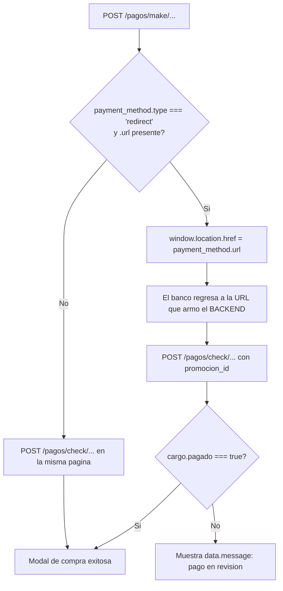

# Flujo 04 — Capa de pagos (OpenPay) y promociones

Estos endpoints **se repiten en todos los flujos de compra** (generales, numerados, abonos,
conferencias, CityPass). Se documentan aqui una sola vez; los flujos concretos solo
referencian este archivo.

---

## 4.1 Arranque del SDK de OpenPay

Cada pagina de compra inyecta dos `<script>` en secuencia:

```
1. https://resources.openpay.mx/lib/openpay.v1.min.js
2. https://resources.openpay.mx/lib/openpay-data-js/1.2.38/openpay-data.v1.min.js
```

Cuando cargan, pide las credenciales y genera el `device_session_id`:

```js
const { merchantId, publicKey, sandbox } = await getCredenciales();
window.OpenPay.setId(merchantId);
window.OpenPay.setApiKey(publicKey);
window.OpenPay.setSandboxMode(sandbox);
const deviceDataId = window.OpenPay.deviceData.setup('formId');
```

> **Hoy no hay tokenizacion en el cliente.** El PAN y el CVV viajan hacia **tu backend**,
> que es quien tokeniza contra OpenPay. Ver [4.7](#47-propuesta-tokenizar-la-tarjeta-en-el-cliente).

### `GET /pagos/get/credenciales`

- **Auth:** se llama sin sesion (corre al montar la pagina). **Body:** ninguno.

```jsonc
// Response
{ "merchantId": "mzdtln0bmtms6o3kck0f", "publicKey": "pk_e56...", "sandbox": true }
```

---

## 4.2 Cliente OpenPay del usuario

### `GET /pagos/get/mi_perfil`

Se llama **inmediatamente despues de una reserva exitosa**, y otra vez antes de borrar una tarjeta.

- **Auth:** requiere Bearer. **Body:** ninguno.

```jsonc
// Response
{
  "idOpenpay": "ag4nktpv0kd6a3a4mfvr",
  "usuario": { "email": "usuario@dominio.com" },
  "tarjetas": [
    {
      "id": 12,
      "idtarjeta": "kdx205ackgpzc7ipavdg",  // id de OpenPay: se usa como source_id y en el DELETE
      "tarjeta": "XXXX-XXXX-XXXX-1234",     // PAN enmascarado
      "banco": "BBVA",
      "marca": "visa",
      "nombreEnTarjeta": "JUAN PEREZ",
      "tipo": "debit"
    }
  ]
}
```

> **Contrato importante:** un **status no-2xx aqui es la señal de "el usuario todavia no tiene
> cliente en OpenPay"**. El front captura el error y llama de inmediato a `POST /pagos/save/usuario`.
> Si el backend empieza a responder `200` con `null`, ese fallback se rompe.

### `POST /pagos/save/usuario`

- **Auth:** requiere Bearer. **Body: ninguno** (se hace POST sin segundo argumento).

```jsonc
// Response
{ "idOpenpay": "ag4nktpv0kd6a3a4mfvr" }
```

### `POST /pagos/save/tarjeta`

Solo cuando el usuario captura una tarjeta nueva **y** confirma el dialogo "¿Quieres guardar tu tarjeta?".
Corre **antes** del cargo y **su fallo no es fatal**: se muestra aviso y la compra sigue.

```jsonc
// Request
{
  "card_number": "4111111111111111",   // solo digitos, 14 a 19
  "holder_name": "JUAN PEREZ",          // solo letras y espacios
  "expiration_year": "28",              // YY (2 digitos)
  "expiration_month": "12",             // MM
  "cvv2": "123",                        // 3 o 4 digitos
  "device_session_id": "kR2z..."        // se omite desde /perfil/mis_formas_de_pago
}
```

```jsonc
// Response
{ "tarjeta": { "id": 12, "idtarjeta": "kdx205...", "tarjeta": "XXXX-...-1234", "banco": "BBVA", "marca": "visa", "nombreEnTarjeta": "JUAN PEREZ", "tipo": "debit" } }
```

En las paginas de compra la respuesta solo se loguea; en `/perfil/mis_formas_de_pago` si se
lee `tarjeta` para agregarla al listado.

### `DELETE /pagos/tarjeta/{clienteId}/{tarjetaId}`

- `clienteId` = `idOpenpay` (se re-consulta con `mi_perfil` justo antes).
- `tarjetaId` = **`tarjeta.idtarjeta`** (el id de OpenPay), **no** el `tarjeta.id` numerico.

```jsonc
// Response
{ "message": "Tarjeta eliminada correctamente" }
```

Si `idOpenpay` viene vacio, el front aborta con
"No puedes eliminar la tarjeta porque no tiene un usuario Openpay."

Validacion de tarjeta en cliente: `src/utils/cardHelpers.ts` usa
`OpenPay.card.validateCardNumber` (Luhn + marca) y `OpenPay.card.validateCVC` cuando el SDK esta cargado.

---

## 4.3 Promociones

### `POST /promociones/validar_promo_web`

Se dispara al cargar la pagina de evento, antes de cualquier otra cosa.

```jsonc
// Request — ojo: evento_id va como NUMBER (parseInt)
{ "evento_id": 1084 }
```

```jsonc
// Response
{
  "total": 3,                          // > 0 habilita el input de codigo de descuento
  "promocionesAplicaDirecto": [        // promos que se aplican solas, sin codigo
    {
      "id": 7,
      "nombre": "2x1 Preventa",
      "tipo": "CANTIDAD",              // "PORCENTAJE" | "CANTIDAD"
      "porcentaje": "15.00",
      "cantidadCompra": 2,             // solo para tipo CANTIDAD (promo NxM)
      "cantidadPaga": 1,
      "aplicaTodoEvento": false,
      "categorias": [
        { "categoria":        { "nombre": "VIP" } },
        { "categoriaGeneral": { "nombre": "General A" } }
      ],
      "promocionPaquetes": false,
      "promocionPareja": true,
      "promocionFamilia": false
    }
  ]
}
```

### `POST /promociones/validar_clave_web`

Se llama cuando el usuario aplica un codigo, y otra vez en silencio cada vez que cambian
los subtotales por categoria.

```jsonc
// Request — ojo: aqui evento_id va como STRING (sin parseInt)
{ "clave": "PREVENTA20", "evento_id": "1084" }
```

La respuesta es el **objeto de promocion directo** (mismo shape que un elemento de
`promocionesAplicaDirecto`). **`id` truthy = codigo valido**; cualquier otra cosa se muestra
como "Codigo de descuento invalido".

### Overrides que hace el cliente

| Condicion | Efecto |
|---|---|
| `promocionPareja === true` y 2 asientos | fuerza `porcentaje = 10` |
| `promocionFamilia === true` y 4 o mas asientos | fuerza `porcentaje = 15` |
| `aplicaTodoEvento === false` | la promo debe hacer match con `nombreEspecial` de la seccion |
| `tipo === "CANTIDAD"` y `boletos < cantidadCompra` | rechaza el codigo en cliente |

> **Match de categorias:** **abonos** compara contra `categorias[].categoria.nombre` y
> **conferencias** contra `categorias[].categoriaGeneral.nombre`, asi que la respuesta de
> `validar_clave_web` debe traer **ambas** claves.

**Todo el calculo del descuento es en cliente.** Al backend solo le llega `promocion_id`.

### `POST /pagos/aplicar-promo`

Se dispara **justo antes del cargo**, solo si `promocion_id > 0`.

```jsonc
// Request
{ "promocionId": 7, "eventoId": 1084 }
```

- **Response:** se ignora. Presumiblemente incrementa el contador de redenciones.
- Si el cargo posterior falla con `error.response.data.isPromoError === true`,
  el front revierte todo el estado del descuento.

---

## 4.4 Formula del `amount`

El backend calcula el total por su cuenta. El cliente lo calcula tambien y lo manda en
`amount` **para que el backend contraste ambos**: si no coinciden, el cargo se rechaza.
Asi se evita mostrar un precio en pantalla y cobrar otro.

```
truncar(v) = Math.trunc(v * 1000) / 1000

subtotal = (boletos * precioUnitario) - descuentoCalculadoEnCliente

total = truncar(subtotal)
      + truncar(subtotal * udt)                                    // usoDeTarjeta
      + (udsPorCategoria ? UDS : truncar(subtotal * uds))          // usoDeServicio
      + (isIvaApplied ? truncar(subtotal * iva) : 0)               // ivaRate

amount = parseFloat(total.toFixed(2))
```

`UDS` = suma de (subtotal por categoria x `cargoPorCategoria`), tomado de `categoriasEvento`
o `cargosPorCategoria`.

> **Tipo del campo:** `detalleEventoPage` manda `amount` como **string** (`.toFixed(2)`),
> `infoEventoPage` como **number**, y `formConferenciaPage` como **string** dentro de un multipart.

---

## 4.5 Contrato comun de los cargos

Todos los `POST /pagos/make/*` responden con la misma envoltura:

```jsonc
{
  "cargo": {
    "id": "trzunhilfxbmhtoy2eyh",       // -> transaccionId
    "status": "charge_pending",
    "payment_method": {
      "type": "redirect",               // si es "redirect" -> 3D Secure
      "url": "https://sandbox-api.openpay.mx/v1/..."
    }
  }
}
```

### Bifurcacion 3D Secure



> **`redirect_url` siempre se manda como el literal `"/"`** desde todas las paginas.
> Es decir: **la URL real de retorno la construye el backend**, y debe apuntar a la ruta
> `terminar_compra*` que corresponda, con `?id={transaccionId}` en el query string.

### Campos que lee la pagina de retorno

Todas las paginas `TerminarCompra*` aceptan status **200 o 201** y leen:

| Campo | Uso |
|---|---|
| `cargo.pagado` (boolean) | **Compuerta del exito.** Si es falso se muestra `message` |
| `message` | Texto mientras el pago no esta confirmado |
| `email` | "Recibiras un correo a ..." |
| `total` | "Total pagado" |
| `evento.nombre`, `evento.recinto.nombre` | Encabezado del ticket |
| `id` | Id del ticket (solo lo usaban los envios de correo, hoy comentados) |

---

## 4.6 Matriz de endpoints de cargo

| Flujo | make | check | Body del check |
|---|---|---|---|
| Generales / Numerados | `/pagos/make/cargo` | `/pagos/check/cargo/{transaccionId}` | `{reservaId, esGeneral}` + `promocion_id` solo en el retorno 3DS |
| Abonos | `/pagos/make/cargo_abono` | `/pagos/check/cargo_abono/{transaccionId}` | **sin body** |
| Conferencia · pago | `/pagos/make/conferencia/cargo` | `/pagos/check/conferencia/cargo/{invitadoId}/{transaccionId}` | `{reservaId, esGeneral, promocion_id}` |
| Conferencia · gratis | — | `/pagos/check/conferencia/cargo/gratis/{invitadoId}` | `{reservaId, esGeneral, promocion_id}` |
| CityPass | `/pagos/citypass/make/cargo` | `/pagos/citypass/check/cargo/{transaccionId}` | **sin body** |

---

## 4.7 Propuesta: tokenizar la tarjeta en el cliente

**Recomendado.** Hoy el numero de tarjeta y el CVV pasan por nuestro backend antes de llegar a
OpenPay. Si en su lugar el navegador tokeniza contra OpenPay y solo manda el token, **el PAN
nunca toca nuestra infraestructura**.

Por que conviene:

| | Hoy | Con tokenizacion en cliente |
|---|---|---|
| Donde pasa el PAN | navegador → nuestro backend → OpenPay | navegador → OpenPay |
| Alcance PCI DSS | el backend entra en alcance (SAQ D) | se reduce fuerte (SAQ A-EP) |
| Riesgo en logs / APM / dumps | el PAN puede acabar en un log por accidente | no hay PAN que loguear |
| Fuga de nuestra BD o servidor | expone datos de tarjeta en transito | no hay datos de tarjeta |
| Dependencia nueva | — | ninguna: el SDK ya esta cargado |

### Cambio en el cliente

`openpay.v1.min.js` ya se carga y ya tiene las credenciales configuradas, asi que solo hay
que crear el token antes del cargo:

```js
const tokenizarTarjeta = (tarjeta) =>
  new Promise((resolve, reject) => {
    window.OpenPay.token.create(
      {
        card_number: tarjeta.card_number,
        holder_name: tarjeta.holder_name,
        expiration_year: tarjeta.expiration_year,   // "YY"
        expiration_month: tarjeta.expiration_month, // "MM"
        cvv2: tarjeta.cvv2,
      },
      (res) => resolve(res.data.id),   // <- token id
      (err) => reject(err),
    );
  });
```

Y el payload del cargo pierde el objeto `tarjeta`:

```diff
  {
    "reservaId": "RES-88213",
    "esGeneral": true,
    "tipoDispositivo": "web",
-   "source_id": "",
-   "tarjeta": {
-     "card_number": "4111111111111111",
-     "holder_name": "JUAN PEREZ",
-     "expiration_year": "28",
-     "expiration_month": "12",
-     "cvv2": "123",
-     "device_session_id": "kR2z..."
-   },
+   "source_id": "kqgykn9ohtmqhcxbfdbk",   // token de OpenPay, de un solo uso
    "amount": "1856.40",
    "device_session_id": "kR2z...",
    "redirect_url": "/",
    "promocion_id": 0
  }
```

`source_id` **ya existe** en el contrato: es el campo que hoy lleva el id de una tarjeta
guardada. Un token de OpenPay se manda por el mismo campo, asi que el shape del cargo se
simplifica en vez de crecer.

### Cambio en el backend

1. Aceptar en `source_id` tanto un id de tarjeta guardada como un token de tokenizacion.
2. **Dejar de aceptar el objeto `tarjeta`** una vez migrados todos los flujos, para que no
   quede una via por la que siga entrando el PAN.
3. `POST /pagos/save/tarjeta` tambien puede recibir el token en lugar de los datos en claro.

### Puntos a cuidar

- **El token es de un solo uso.** Si el cargo falla y el usuario reintenta, hay que generar
  uno nuevo; no se puede reusar el anterior.
- **`device_session_id` se sigue mandando aparte.** La tokenizacion no lo reemplaza: es el
  dato antifraude y viaja en el nivel superior del payload, como hoy.
- **Los errores de tarjeta se mueven al cliente.** Tarjeta invalida o rechazada ahora falla en
  el callback de `token.create`, antes de llegar a nuestro backend; hay que mostrarlos ahi.
- **La validacion local se mantiene**: `cardHelpers.ts` sigue filtrando errores de captura
  antes de gastar una llamada a OpenPay.
- **Migracion por flujo.** Se puede empezar por un flujo (generales, por ejemplo) mientras el
  backend acepta las dos formas, y retirar el objeto `tarjeta` al final.
