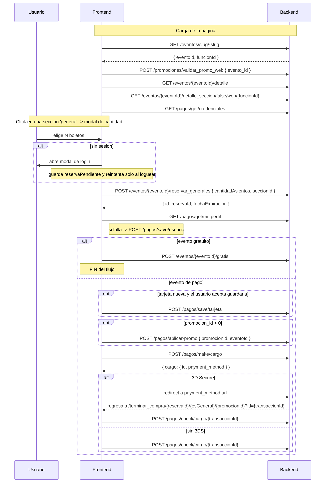

# Flujo 05 — Compra de boletos GENERALES

Aplica cuando la seccion elegida tiene `tipo_seccion === "general"`. El usuario elige una
**cantidad**, no asientos concretos. Ocurre dentro de un modal en la misma pagina de detalle.

- Pagina principal: `src/eventos/pages/detalleEventoPage.tsx` (ruta `/eventos/:slug`)
- Variante antigua: `src/eventos/pages/infoEventoPage.tsx` (ruta `/eventos/informacion/:slug`) —
  mismo flujo **sin promociones ni eventos gratuitos**.

La capa de pagos (`/pagos/*`) y promociones esta en [flujo 04](./04-pagos-openpay.md).
El catalogo y el detalle del evento estan en [flujo 03](./03-catalogo-eventos.md).

---

## Secuencia completa



---

## 5.1 `POST /eventos/{eventoId}/reservar_generales`

**Requiere sesion.** Si no hay `user`, el front abre el modal de login, guarda
`reservaPendiente` y **reintenta la reserva automaticamente** cuando el login termina.

- `{eventoId}` es el **id numerico** del evento, no el slug.

```jsonc
// Request — exactamente dos claves
{ "cantidadAsientos": 3, "seccionId": 45 }
```

| Campo | Tipo | Origen |
|---|---|---|
| `cantidadAsientos` | `number` | Estado `boletos`. Acotado por `limiteDeAsientos` del evento y por `asientosDisponibles` de la seccion |
| `seccionId` | `number` | `Seccion.id` que vino de `detalle_seccion` |

```jsonc
// Response
{ "id": "RES-88213", "fechaExpiracion": "2026-08-24T18:35:00.000Z" }
```

| Campo | Uso |
|---|---|
| `id` | Es el **reservaId**. Su truthiness abre todo el resto del flujo |
| `fechaExpiracion` | ISO. Alimenta el contador; al llegar a cero la pagina recarga |

**Si `id` viene falsy:** el front muestra "Uno o mas asientos ya no estan disponibles" y hace
`window.location.reload()`.

> **La funcion NO viaja en este request.** La funcion queda implicita en `seccionId`,
> que salio de un `detalle_seccion` que si estaba filtrado por funcion. Si `detalle_seccion`
> se invoca con `undefined`/`null` en la ruta, las secciones que vuelven son las que el
> backend decida por defecto.

---

## 5.2 `POST /pagos/make/cargo`

**Requiere sesion.**

```jsonc
// Request
{
  "reservaId": "RES-88213",
  "esGeneral": true,                 // literal
  "tipoDispositivo": "web",          // literal
  "source_id": "kdx205ackgpzc7ipavdg",  // id de tarjeta guardada, o "" si es tarjeta nueva
  "tarjeta": {                       // undefined cuando se usa tarjeta guardada
    "card_number": "4111111111111111",
    "holder_name": "JUAN PEREZ",
    "expiration_year": "28",
    "expiration_month": "12",
    "cvv2": "123",
    "device_session_id": "kR2z..."
  },
  "amount": "1856.40",               // string en detalleEventoPage, number en infoEventoPage
  "device_session_id": "kR2z...",
  "redirect_url": "/",               // literal: el backend arma la URL real de retorno
  "promocion_id": 0,                 // solo lo manda detalleEventoPage
  "usuarioOpenpayId": "ag4nktpv..."  // SOLO cuando se usa tarjeta guardada
}
```

Respuesta y bifurcacion 3DS: ver [flujo 04, seccion 4.5](./04-pagos-openpay.md#45-contrato-comun-de-los-cargos).

---

## 5.3 `POST /pagos/check/cargo/{transaccionId}`

Se llama en dos contextos con **bodies distintos**:

```jsonc
// (a) Sin 3DS, desde el modal — NO manda promocion_id
{ "reservaId": "RES-88213", "esGeneral": true }
```

```jsonc
// (b) Retorno de 3DS, desde /terminar_compra/... — promocion_id como STRING
{ "reservaId": "RES-88213", "esGeneral": true, "promocion_id": "7" }
```

En el caso (a) la respuesta practicamente se ignora (solo se loguea) y se muestra el modal
de exito. En el caso (b) se leen `cargo.pagado`, `message`, `email`, `total`,
`evento.nombre` y `evento.recinto.nombre`.

**Ruta de retorno que debe construir el backend:**

```
/terminar_compra/{reservaId}/{esGeneral}/{promocionId}?id={transaccionId}
```

---

## 5.4 `POST /eventos/{eventoId}/gratis` (eventos con `esGratuito: true`)

Sustituye por completo al bloque de pago: no hay OpenPay, ni `mi_perfil`, ni promociones.

```jsonc
// Request
{
  "esGeneral": true,                 // literal para este flujo
  "reservaId": "RES-88213",
  "email": "usuario@dominio.com",    // user.email
  "nombre": "Juan Perez"             // user.fullName
}
```

- **Response:** solo se comprueba que sea truthy; trae `id` (id del ticket).
- Al exito: alerta + `window.location.reload()`.

---

## 5.5 `POST /eventos/{eventoId}/cancelar`

Se dispara desde el boton "Cancelar compra" y tambien **al cerrar el modal**.

```jsonc
// Request
{ "reservaId": "RES-88213", "esGeneral": true }
```

Cualquier valor truthy en la respuesta se toma como exito y la pagina recarga.

---

## 5.6 Endpoint implementado sin consumidores

`POST /eventos/{eventoId}/vender` con body `{ reservaId, metodoPago }` existe en
`useEventosStore` pero **ningun componente lo llama**. Es un remanente del flujo de venta
en efectivo.

---

## 5.7 Diferencias de `infoEventoPage`

La ruta `/eventos/informacion/:slug` corre la misma secuencia **menos**:

- `POST /promociones/validar_promo_web` y `validar_clave_web` (sin promociones)
- `POST /pagos/aplicar-promo`
- `POST /eventos/{id}/gratis` (no soporta eventos gratuitos)
- `promocion_id` no se incluye en el body de `make/cargo`

Ademas manda `amount` como **number** y trunca a 3 decimales en vez de usar `toFixed(2)`.
