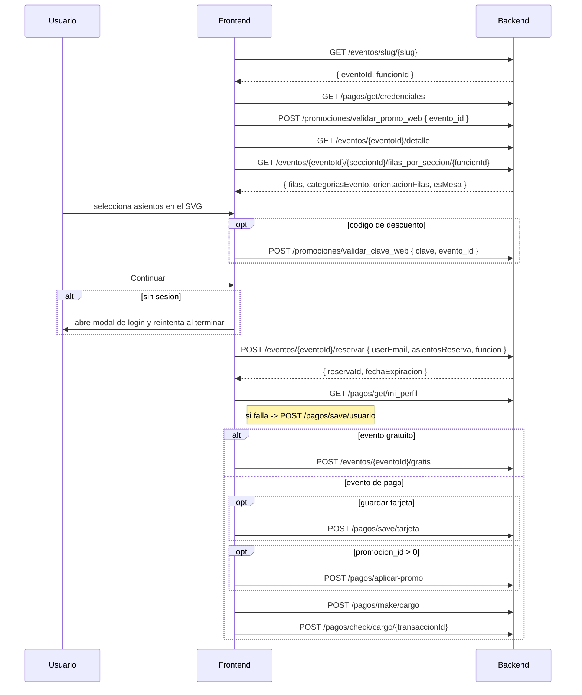

# Flujo 06 — Compra de asientos NUMERADOS

Aplica cuando `tipo_seccion !== "general"` (`numerada`, `suite`, `mesas`). El usuario elige
asientos concretos sobre un mapa SVG.

- Ruta: `/eventos/:slug/:seccionId/:seccion`
- Pagina: `src/eventos/pages/SeccionAsientoPage.tsx`

La capa de pagos y promociones esta en [flujo 04](./04-pagos-openpay.md).

> **No hay socket.io.** `socket.io-client` esta en `package.json` pero **no se importa en
> ningun archivo de `src/`**. La frescura del mapa de asientos depende de: (a) el fetch al
> montar, (b) el `reservaId` falsy que fuerza recarga cuando alguien tomo el asiento antes,
> y (c) el contador de expiracion de la reserva.

---

## Secuencia completa



---

## 6.1 `GET /eventos/{idEvento}/{idSeccion}/filas_por_seccion[/{funcionId}]`

Es **el mapa de asientos**. El ultimo segmento se agrega **solo si `funcionId` es truthy**.

- **Auth:** publico. **Body:** ninguno.

```jsonc
// Response
{
  "filas": [
    {
      "id": 301,
      "nombre": "A",
      "udt": "0.03",     // usoDeTarjeta  — SOLO se lee de filas[0]
      "uds": "0.10",     // usoDeServicio — SOLO se lee de filas[0]
      "iva": "0.16",     // ivaRate       — SOLO se lee de filas[0]
      "asientos": [
        {
          "id": 9001,
          "numero": "12",
          "estado": "disponible",
          "precio": 850,
          "fila": "A",
          "categoria": "VIP",
          "color": "#FFD700"
        }
      ]
    }
  ],
  "preciosCategorias": [
    { "categoria": "VIP", "color": "#FFD700", "precios": [2500, 1800] }
  ],
  "categoriasEvento": [
    { "id": 1, "categoria": "VIP", "cargoPorCategoria": "50.00" }
  ],
  "orientacionFilas": "left",   // 'left' | 'right' | otro
  "esMesa": false
}
```

| Campo | Efecto |
|---|---|
| `asiento.estado` | `disponible` \| `vendido` \| `bloqueado` \| `inaccesible` \| `reservado` \| `cortesia`. **Solo `disponible` es seleccionable** |
| `asiento.color` | Hex, se usa como `fill` del SVG en asientos disponibles |
| `asiento.precio` | El front hace `Number()` / `+precio` en todas partes: acepta number o string |
| `orientacionFilas` | Alineacion de las filas en pantalla |
| `esMesa` | Si es `true`, **se autoseleccionan todos los asientos de todas las filas** y se desactiva el click individual |
| `categoriasEvento[].cargoPorCategoria` | Cargo por servicio por categoria, usado cuando `udsPorCategoria === true` |

> **Ojo con las tarifas:** `udt`, `uds` e `iva` se leen **unicamente de `filas[0]`**.
> Si la primera fila no las trae, el calculo del total sale mal.

---

## 6.2 `POST /eventos/{eventoId}/reservar`

**Requiere sesion.** Sin `user`, el front abre el modal de login, guarda `reservaPendiente`
y reintenta la reserva al terminar.

```jsonc
// Request
{
  "userEmail": "usuario@dominio.com",
  "asientosReserva": [9001, 9002, 9003],   // ids de asiento
  "funcion": "77"                           // funcionId; undefined en eventos de fecha unica
}
```

```jsonc
// Response
{ "reservaId": "RES-88213", "fechaExpiracion": "2026-08-24T18:35:00.000Z" }
```

> Nota: aqui el campo es **`reservaId`**, mientras que en generales
> (`reservar_generales`) es **`id`**.

**Validaciones previas del cliente:** al menos 1 asiento, y
`asientosReserva.length <= evento.limiteDeAsientos`.

**Si `reservaId` viene falsy:** alerta "Uno o mas asientos ya no estan disponibles" y recarga.

---

## 6.3 `POST /pagos/make/cargo`

Body identico al de [generales](./05-compra-generales.md#52-post-pagosmakecargo) salvo:

```diff
- "esGeneral": true
+ "esGeneral": false
```

`amount` se calcula con la formula de [flujo 04, seccion 4.4](./04-pagos-openpay.md#44-formula-del-amount),
donde el subtotal es la suma de precios de los asientos seleccionados menos el descuento.

---

## 6.4 `POST /pagos/check/cargo/{transaccionId}`

```jsonc
// Sin 3DS, en la misma pagina
{ "reservaId": "RES-88213", "esGeneral": false }
```

Con 3DS, el backend regresa a
`/terminar_compra/{reservaId}/{esGeneral}/{promocionId}?id={transaccionId}` y el body suma
`promocion_id` (string). Campos leidos: `cargo.pagado`, `message`, `email`, `total`,
`evento.nombre`, `evento.recinto.nombre`.

---

## 6.5 `POST /eventos/{eventoId}/gratis`

```jsonc
{
  "esGeneral": false,        // literal para numerados
  "reservaId": "RES-88213",
  "email": "usuario@dominio.com",
  "nombre": "Juan Perez"
}
```

Al exito: modal + recarga. Si el endpoint falla, la reserva **no se revierte**.

---

## 6.6 `POST /eventos/{eventoId}/cancelar`

```jsonc
{ "reservaId": "RES-88213", "esGeneral": false }
```

Se lee `response.success` (boolean): `true` → toast + recarga; falsy → "No se pudo cancelar la reserva".

---

## 6.7 Correos de boletos

Todos los `POST /correos/sold-tickets-email*` de este flujo **estan comentados**.
Se asume que **el backend envia los correos por su cuenta**.

| Endpoint | Estado en este flujo |
|---|---|
| `/correos/sold-tickets-email/{email}/{ticketId}` | comentado |
| `/correos/sold-tickets-email-3d/{ticketId}` | comentado |

Siguen vivos en abonos, en el detalle de evento y en conferencias — ver esos flujos.
