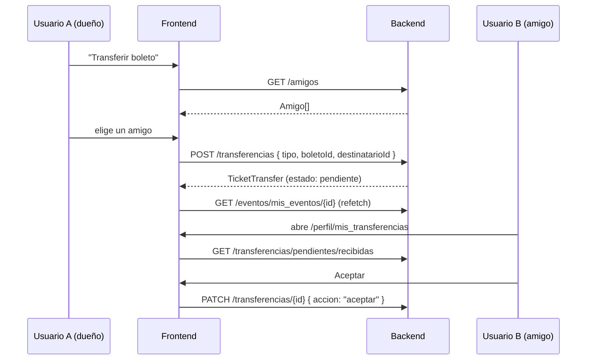

# Flujo 10 — Transferencias de boletos y amigos

Un boleto se transfiere **a un amigo**, no a un correo suelto. Por eso el flujo de amigos
es un prerequisito del de transferencias.

**Todos estos endpoints requieren Bearer.**

---

## 10.1 Amigos

### Endpoints

| Metodo | Ruta | Body |
|---|---|---|
| `POST` | `/amigos/solicitudes` | `{ "telefono": "+525512345678" }` |
| `GET` | `/amigos/solicitudes/recibidas` | — |
| `GET` | `/amigos/solicitudes/enviadas` | — |
| `PATCH` | `/amigos/solicitudes/{id}` | `{ "accion": "aceptar" \| "rechazar" \| "cancelar" }` |
| `GET` | `/amigos` | — |
| `DELETE` | `/amigos/{friendshipId}` | — |

### Formato del telefono

**E.164 estricto**: prefijo de pais con `+`, sin espacios, guiones ni parentesis.
Se construye como `+{dialCode}{soloDigitos}` y **se compara exacto contra el telefono de registro**.

### Tipos

```ts
type EstadoSolicitudAmistad = 'pendiente' | 'aceptada' | 'rechazada' | 'cancelada';
type AccionSolicitud = 'aceptar' | 'rechazar' | 'cancelar';

interface UserMini {
  id: string;              // UUID
  fullName: string;
  email: string | null;
  telefono: string | null;
  image: string | null;
}

interface FriendRequest {
  id: number;
  estado: EstadoSolicitudAmistad;
  createdAt: string;
  respondedAt: string | null;
  solicitante?: UserMini;
  destinatario?: UserMini;
}

interface Amigo {
  friendshipId: number;
  desde: string;
  amigo: UserMini;
}

interface AceptarSolicitudResponse {
  solicitud: FriendRequest;
  friendship: { id: number; createdAt: string; deletedAt: string | null };
}
```

| Endpoint | Response |
|---|---|
| `POST /amigos/solicitudes` | `FriendRequest` |
| `GET /amigos/solicitudes/recibidas` | `FriendRequest[]` |
| `GET /amigos/solicitudes/enviadas` | `FriendRequest[]` |
| `PATCH /amigos/solicitudes/{id}` | `AceptarSolicitudResponse \| { solicitud: FriendRequest }` |
| `GET /amigos` | `Amigo[]` |
| `DELETE /amigos/{friendshipId}` | `{ "ok": true }` |

### Flujo

Al montar `/perfil/mis_amigos` se hace `Promise.all` de las tres lecturas
(`/amigos`, `/amigos/solicitudes/recibidas`, `/amigos/solicitudes/enviadas`).
Despues de **cualquier** mutacion se recargan las tres.

**Polling:** `/amigos/solicitudes/recibidas` cada **30 s**.

---

## 10.2 Transferencias de boletos de evento

### Endpoints

| Metodo | Ruta | Body / query |
|---|---|---|
| `POST` | `/transferencias` | `TransferirBoletoPayload` |
| `POST` | `/transferencias/devolver` | `DevolverBoletoPayload` |
| `PATCH` | `/transferencias/{id}` | `{ "accion": "aceptar" \| "rechazar" \| "cancelar" }` |
| `GET` | `/transferencias/pendientes/recibidas` | — |
| `GET` | `/transferencias/pendientes/enviadas` | — |
| `GET` | `/transferencias/enviadas` | `?page=1&limit=50` |
| `GET` | `/transferencias/recibidas` | `?page=1&limit=50` |
| `GET` | `/transferencias/boleto/{tipo}/{boletoId}` | `tipo` = `asiento` \| `pase` |

### Bodies

```ts
type TipoBoletoTransfer = 'asiento' | 'pase';

interface TransferirBoletoPayload {
  tipo: TipoBoletoTransfer;
  boletoId: number;
  destinatarioId: string;   // UUID = Amigo.amigo.id
}

interface DevolverBoletoPayload {
  tipo: TipoBoletoTransfer;
  boletoId: number;
}
```

> `tipo` se deriva en el cliente: `boleto.eventoSeccion ? 'pase' : 'asiento'`.
> `destinatarioId` **siempre** sale de `Amigo.amigo.id` — nunca de un correo o telefono.

### Response — `TicketTransfer`

Los tres primeros endpoints devuelven uno; los de listado devuelven un array.

```ts
type EstadoTransferencia = 'pendiente' | 'completada' | 'rechazada' | 'cancelada' | 'revertida';

interface TicketTransfer {
  id: number;
  tipo: TipoBoletoTransfer;
  estado: EstadoTransferencia;
  createdAt: string;
  respondedAt: string | null;
  eventoAsiento: { id: number } | null;
  paseGeneral: { id: number } | null;
  fromUser?: UserMini;
  toUser?: UserMini;
  evento: { id: number; nombre?: string } | null;
  funcion: { id: number; nombre?: string; fecha?: string } | null;
}
```

### Flujos



| Accion | Llamadas |
|---|---|
| **Transferir uno** | `GET /amigos` → `POST /transferencias` → refetch de `mis_eventos/{id}` |
| **Transferir varios** | `Promise.allSettled` de N `POST /transferencias` en paralelo, uno por boleto |
| **Devolver** | `POST /transferencias/devolver` → refetch. Bloqueado en cliente si ya hay `transferenciaPendiente` |
| **Cancelar pendiente** | `PATCH /transferencias/{transferenciaPendiente.id}` con `accion: "cancelar"` |

### Bandeja `/perfil/mis_transferencias`

Cuatro GET en paralelo, cada uno con `.catch(() => [])`:

```
GET /transferencias/pendientes/recibidas
GET /transferencias/pendientes/enviadas
GET /citypass/transferencias/pendientes/recibidas
GET /citypass/transferencias/pendientes/enviadas
```

**Polling cada 30 s.** Las acciones se enrutan al `PATCH` correcto (eventos o citypass)
segun el campo `origen` de cada fila.

### Badge del sidebar

En **cada** pagina de `/perfil/*` corre un `Promise.allSettled` cada 30 s:

```
GET /transferencias/pendientes/recibidas
GET /amigos/solicitudes/recibidas
```

Se omite mientras `document.hidden` es `true`.

> **Carga de polling a considerar:** un usuario en `/perfil/mis_transferencias` genera
> 6 peticiones cada 30 s (4 de la bandeja + 2 del sidebar).

---

## 10.3 Endpoints implementados sin consumidores

- `GET /transferencias/enviadas` y `GET /transferencias/recibidas` (los paginados)
- `GET /transferencias/boleto/{tipo}/{boletoId}`
- `GET /boletos/mis` (ver [flujo 09](./09-perfil-boletos.md#96-get-boletosmis--implementado-sin-consumidores))

---

## 10.4 Transferencias de CityPass

Mismo patron pero endpoints propios y **una diferencia de contrato**: el body de devolucion
**no lleva `tipo`**. Ver [flujo 11](./11-citypass.md#116-transferencias-de-citypass).
