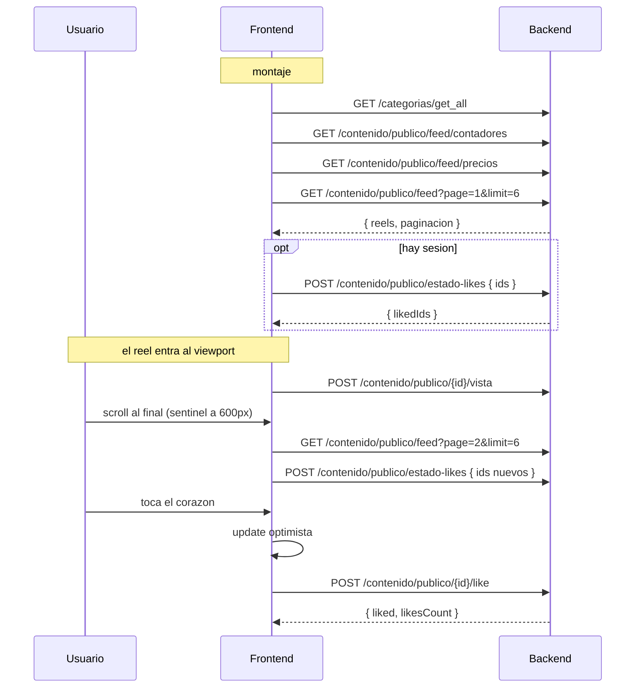

# Flujo 12 — Explorar / Reels

Feed vertical de contenido tipo reel en `/explorar` (`src/explorar/`), servido por
`useContenidoStore`. Es el unico modulo del front donde **todo el filtrado es server-side**:
el cliente no filtra nada en memoria, solo arma el query string.

> El propio store apunta al contrato del backend en
> `docs/integracion/contenido/README.md` (repo `taquillavipbackend-v2`).

---

## 12.1 Regla del query string

El helper `qs()` **omite `undefined`, `null` y `""`** antes de serializar. Un filtro sin valor
simplemente no aparece en la URL — nunca se manda `categoriaId=null`.

```ts
const qs = (obj: Record<string, unknown>) => {
  const p = new URLSearchParams();
  Object.entries(obj).forEach(([k, v]) => {
    if (v !== undefined && v !== null && v !== "") p.set(k, String(v));
  });
  return p.toString();
};
```

### Modelo de filtros

```ts
// "" = sin filtro de tiempo
type ReelCuando = "" | "hoy" | "manana" | "semana" | "fin_semana";

interface ReelFiltros {
  cuando: ReelCuando;         // chips de tiempo (aplica de inmediato)
  categoriaId: number | null; // categoria del evento
  precioMin: number | null;   // rango de precio (solo internos con boletaje)
  precioMax: number | null;
  ciudadId: number | null;    // ciudad del recinto
  eventoId: number | null;    // reels de un evento puntual (deep link)
}
```

Los seis filtros **se persisten en los query params de la URL** con `replace: true`,
asi que la vista filtrada es compartible y sobrevive un refresh.

---

## 12.2 `GET /contenido/publico/feed`

- **Auth:** anonimo. Con sesion o sin ella responde igual; `liked` **siempre viene `false`**
  y se hidrata aparte (ver 12.5).

**Query params:** `page` (default `1`), `limit` (default `6`), `cuando`, `categoriaId`,
`precioMin`, `precioMax`, `ciudadId`, `eventoId`.

```jsonc
// Response
{
  "reels": [
    {
      "id": 31,
      "titulo": "Tuff Riders en vivo",
      "descripcion": "...",
      "textoBoton": "Comprar boletos",
      "categoria": { "id": 1, "nombre": "Conciertos" },
      "tags": ["Conciertos"],              // = [categoria.nombre], por compatibilidad
      "likesCount": 120,
      "vistasCount": 3400,
      "liked": false,                       // siempre false aqui
      "fechaPublicacion": "2026-08-01T12:00:00.000Z",

      "evento": {
        "id": 1084,                         // null cuando externo === true
        "nombre": "Tuff Riders",
        "fecha": "2026-09-12T20:00:00.000Z",
        "externo": false,                   // decide la navegacion del CTA
        "url": null,                        // solo si externo === true
        "esMultiFuncion": true,
        "recinto": {                        // null en externos
          "id": 12, "nombre": "Auditorio X",
          "direccion": "Av. ...", "ciudad": "Torreon"
        }
      },

      "media": [
        {
          "id": 5,
          "tipo": "video",                  // "video" | "imagen"
          "url": "https://cdn/.../reel.mp4",
          "thumbnailUrl": "https://cdn/.../thumb.jpg",
          "orden": 1,
          "ancho": 1080, "alto": 1920, "duracionSeg": 22
        }
      ]
    }
  ],
  "paginacion": {
    "total": 40,
    "totalPaginas": 7,
    "paginaActual": 1,
    "itemsPorPagina": 6
  }
}
```

| Campo | Nota de consumo |
|---|---|
| `evento` | Puede ser `null`. Entonces el CTA no hace nada |
| `evento.externo` | `true` → el CTA abre `url` en pestaña nueva, previa confirmacion |
| `evento.id` | **`null` cuando `externo === true`**. Si es `null` sin ser externo, el CTA no hace nada |
| `evento.esMultiFuncion` | `true` → el CTA abre el selector de fechas (ver 12.7) |
| `media[]` | Se ordena por `orden`. `ancho`/`alto`/`duracionSeg` son opcionales |
| `paginacion.paginaActual` | El front confia en este valor, no en su propio contador |
| `paginacion.totalPaginas` | `paginaActual < totalPaginas` es la condicion de "hay mas" |

---

## 12.3 `GET /contenido/publico/feed/contadores`

Alimenta los badges numericos de los chips Hoy / Mañana / Semana / Fin de semana.

- **Auth:** anonimo.
- **Query params:** los mismos del feed **EXCEPTO `cuando`** — esta forzado por el tipo
  (`Omit<Partial<ReelFiltros>, "cuando">`). Tiene sentido: los contadores muestran cuantos
  reels caerian en cada bucket, asi que no pueden estar filtrados por bucket.

```jsonc
{ "hoy": 4, "manana": 2, "semana": 11, "finSemana": 6, "total": 40 }
```

**Se re-consulta al cambiar `categoriaId`, `precioMin`, `precioMax`, `ciudadId` o `eventoId`
— nunca al cambiar `cuando`.**

---

## 12.4 `GET /contenido/publico/feed/precios`

Define los limites del slider de precio.

- **Auth:** anonimo.
- **Query params:** `categoriaId`, `ciudadId`, `cuando`, `eventoId` — es decir, los del feed
  **EXCEPTO `precioMin`/`precioMax`**, por la misma razon que arriba.

```jsonc
{ "min": 350, "max": 2500 }
```

> **`{ "min": 0, "max": 0 }` significa "sin boletaje"** en el conjunto filtrado.
> El front lo trata como caso especial, no como un rango de 0 a 0.

**Detalle de UX que afecta al request:** el `categoriaId` que se manda aqui es el del
**borrador del panel** (`draftPanel.categoriaId`), no el filtro aplicado. Asi el rango del
slider se adapta a la categoria que el usuario esta eligiendo **antes** de pulsar
"Aplicar filtros". Los demas params si son los ya aplicados.

---

## 12.5 Likes

### `POST /contenido/publico/estado-likes`

Hidrata los corazones despues de cargar el feed. **Requiere sesion.**

```jsonc
// Request
{ "ids": [31, 32, 33] }

// Response
{ "likedIds": [31, 33] }
```

Solo se mandan los ids **todavia no hidratados** (`likesHydratedRef` los va marcando),
asi que al paginar solo viajan los nuevos. Si la peticion falla, esos ids se desmarcan
para que el siguiente intento los reintente.

> Corre tambien **cuando `user` aparece**, no solo cuando llegan reels: el feed puede cargar
> antes de que `checkAuthToken` resuelva la sesion.

### `POST /contenido/publico/{id}/like`

Toggle **idempotente**. **Requiere sesion.** Sin body.

```jsonc
{ "liked": true, "likesCount": 121 }
```

| Situacion | Comportamiento del front |
|---|---|
| Sin sesion (antes de llamar) | Redirige a `/auth/login`, no hace la peticion |
| Al pulsar | **Update optimista**: pinta el corazon y ±1 al contador de inmediato |
| Respuesta OK | Sobrescribe con los valores del servidor (`liked`, `likesCount`) |
| Error 401 | Revierte el optimista **y** redirige a `/auth/login` |
| Otro error | Solo revierte el optimista |

### `POST /contenido/publico/{id}/vista`

Registro de vista. **Anonimo**, sin body.

```jsonc
{ "vistasCount": 3401 }
```

Se dispara **una sola vez por reel** cuando entra al viewport, con deduplicacion en
`vistasRef`. Ese set **se limpia** cada vez que cambian los filtros, asi que un reel puede
volver a contar vista tras un cambio de filtro.

---

## 12.6 `GET /contenido/publico/{id}` — sin consumidores

Detalle de un reel por id, pensado para deep link o share. Devuelve un `Reel`.
**Esta implementado en el store pero ningun componente lo llama hoy.**

---

## 12.7 Resolucion del CTA — `resolverDestino`

Lo decide `src/explorar/helpers/navegacion.ts` a partir de `reel.evento`:

```ts
type DestinoReel =
  | { tipo: "interno-detalle"; eventoId: number; evento: ReelEvento }
  | { tipo: "interno-fechas";  eventoId: number; evento: ReelEvento }
  | { tipo: "externo"; url: string }
  | { tipo: "ninguno" };
```

| Condicion (en orden) | Destino |
|---|---|
| `evento == null` | `ninguno` |
| `evento.externo === true` y hay `url` | `externo` |
| `evento.externo === true` y **no** hay `url` | `ninguno` |
| `evento.id == null` | `ninguno` |
| `evento.esMultiFuncion === true` | `interno-fechas` |
| resto | `interno-detalle` |

### Que hace cada destino

- **`interno-detalle`** → navega a `/eventos/{slug}`.
- **`externo`** → alerta de confirmacion *"Vas a salir de {marca}"* y, si acepta,
  `window.open(url, "_blank", "noopener,noreferrer")`.
- **`interno-fechas`** → **dispara una peticion extra**:

```
GET /eventos/{evento.id}/detalle
```

Se leen `detalle.funciones[].{id, fecha, nombre}` para armar un `<select>`.
Si `funciones` viene vacio, navega al detalle sin funcion.

> **La funcion elegida viaja dentro del slug**, no como query param
> (`/eventos/sky-fest-laguna-7-matutino`). El slug del reel se construye **solo con
> `evento.nombre`**: recinto, ciudad y fecha se dejan fuera a proposito porque alargan
> la URL y se leen mal al compartirla.

Este es el unico punto donde el modulo de reels toca la API de eventos
([flujo 03](./03-catalogo-eventos.md#35-detalle-de-evento--get-eventosiddetalle)).

---

## 12.8 Secuencia de la pagina



### Cuando se dispara cada peticion

| Peticion | Disparador |
|---|---|
| `GET /categorias/get_all` | Una sola vez al montar |
| `GET .../feed/contadores` | Cambio de `categoriaId`, `precioMin`, `precioMax`, `ciudadId`, `eventoId` |
| `GET .../feed/precios` | Cambio de `draftPanel.categoriaId`, `ciudadId`, `cuando`, `eventoId` |
| `GET .../feed` (pagina 1) | Cambio de **cualquier** filtro, o `reloadKey`. Resetea reels, `vistasRef` y `likesHydratedRef` |
| `GET .../feed` (pagina N) | Infinite scroll — `IntersectionObserver` con `rootMargin: "600px 0px"` |
| `POST .../estado-likes` | Aparecen reels sin hidratar **y** hay `user` |
| `POST .../vista` | El reel activo cambia (`threshold: 0.6`) y no estaba en `vistasRef` |
| `POST .../like` | Tap del usuario |
| `GET /eventos/{id}/detalle` | CTA de un reel con `esMultiFuncion` |

### Notas de resiliencia

- `getCategorias`, `getContadores` y `getPrecios` van con `.catch(() => {})`:
  **si fallan, la pagina sigue funcionando** sin badges, sin slider calibrado o sin
  categorias en el panel.
- Un fallo al paginar **conserva los reels ya cargados**; el sentinel reintenta al
  re-observarse.
- Solo el fallo del feed inicial pinta estado de error.

---

## 12.9 Endpoints del flujo

| Metodo | Ruta | Auth | Body |
|---|---|---|---|
| GET | `/contenido/publico/feed` | no | — |
| GET | `/contenido/publico/feed/contadores` | no | — |
| GET | `/contenido/publico/feed/precios` | no | — |
| GET | `/contenido/publico/{id}` | no | — · *sin consumidores* |
| POST | `/contenido/publico/estado-likes` | **si** | `{ ids: number[] }` |
| POST | `/contenido/publico/{id}/like` | **si** | sin body |
| POST | `/contenido/publico/{id}/vista` | no | sin body |
| GET | `/categorias/get_all` | no | — · compartido con [flujo 03](./03-catalogo-eventos.md) |
| GET | `/eventos/{id}/detalle` | no | — · solo para el selector de fechas |

> `ciudadId` sale de `GET /ciudades/get_all_ciudades` ([flujo 03](./03-catalogo-eventos.md#33-catalogos-auxiliares)).
