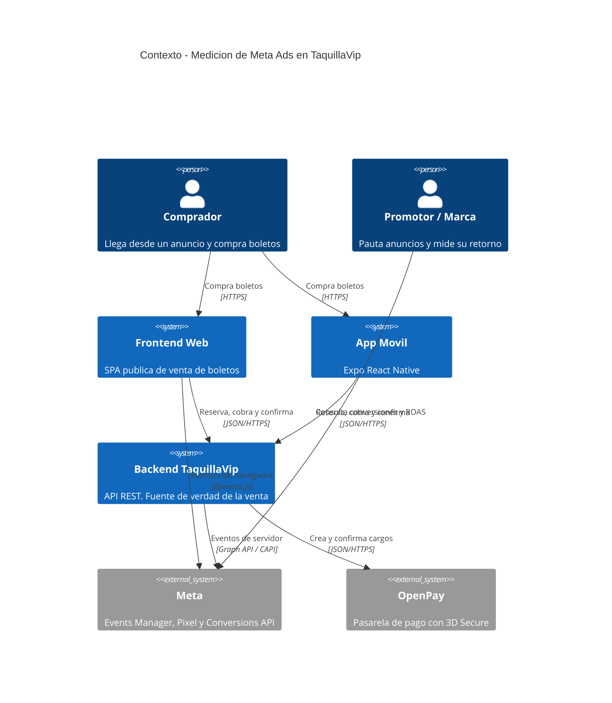
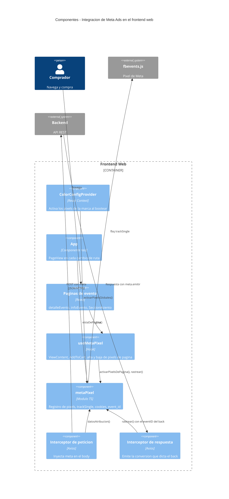
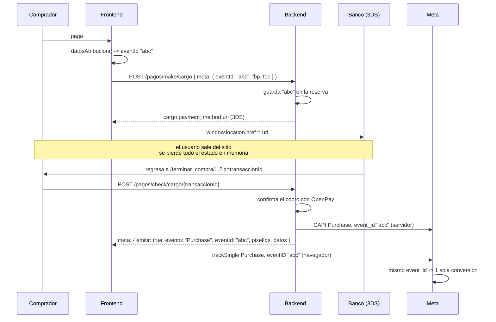

# Flujo 13 — Meta Ads (Pixel + Conversions API)

Como el front reporta conversiones a Meta con **varios pixels a la vez**, y como se coordina
con la Conversions API del backend para que cada venta se cuente **una sola vez**.

A diferencia del resto de los flujos, este no tiene endpoints propios: **se monta encima de
los flujos 01, 03, 05, 06, 07, 08 y 11** agregando un campo `meta` a peticiones y respuestas
que ya existen.

Archivos:

| Archivo | Rol |
|---|---|
| `src/utils/metaPixel.ts` | Capa base sin React: registro de pixels, `trackSingle`, cookies, `event_id` |
| `src/hooks/useMetaPixel.ts` | `useMetaPixel()` y `usePixelsDeEvento()` |
| `src/api/apiApplication.ts` | Interceptores: inyecta atribucion al salir, emite conversiones al volver |
| `src/context/ColorContext.tsx` | Activa los pixels de la marca al bootear |
| `src/App.tsx` | `PageView` en cada cambio de ruta |

---

## 13.1 Las dos ideas base

**Deduplicacion.** Cada conversion se le manda a Meta **dos veces**: una desde el navegador
(Pixel) y otra desde el servidor (Conversions API), con el **mismo `event_id`**. Meta las une
en una sola conversion. El Pixel lo bloquean adblockers, ITP de Safari y el fin de las cookies
de terceros — se pierde entre 20% y 40% de las conversiones. CAPI no lo bloquea nadie, pero no
ve la navegacion. Juntos cubren lo que ninguno cubre solo.

**Multi-pixel.** En una misma pantalla conviven los pixels de la marca (todo el sitio) y los
del promotor del evento que se esta viendo. Por eso **nunca** se llama `fbq('track', ...)`:
esa forma le manda el evento a *todos* los pixels inicializados y el promotor del evento A
terminaria viendo las ventas del evento B. Todo sale por `fbq('trackSingle', pixelId, ...)`.

---

## 13.2 Contexto (C4 nivel 1)



Las flechas del frontend y del backend hacia Meta **no son alternativas**: son el mismo evento
duplicado a proposito. El backend es la fuente de verdad porque es el unico que sabe si OpenPay
realmente cobro y por cuanto.

---

## 13.3 Componentes del front (C4 nivel 3)



---

## 13.4 De donde salen los pixels

Dos origenes, y se **suman**:

| Origen | Endpoint | Campo | Vive | Se activa en |
|---|---|---|---|---|
| Marca | `GET /configuraciones/detail/1` ([flujo 01](./01-bootstrap-configuracion.md)) | `metaPixels` | toda la sesion | `ColorContext.tsx` |
| Evento | `GET /eventos/{id}/detalle` ([flujo 03](./03-catalogo-eventos.md)) | `metaPixels` | mientras la pagina este montada | `usePixelsDeEvento()` |

```jsonc
// GET /configuraciones/detail/1  — solo los globales
{ "...": "resto de la config", "metaPixels": ["111111111", "222222222"] }

// GET /eventos/{id}/detalle  — solo los del promotor de ese evento
{ "...": "resto del evento", "metaPixels": ["333333333"] }
```

En el detalle del evento **no se repiten los globales**: el front ya los tiene activos y los
suma solo.

`normalizarPixelIds` acepta `["123"]`, `[{ pixelId: "123" }]` y un `"123"` suelto — este ultimo
por compatibilidad con la primera version del backend, que exponia un solo `metaPixelId`. Lo
que no sea un ID numerico valido se descarta: un pixel mal capturado en el admin no rompe la
pagina.

**Si no hay pixels configurados, `fbevents.js` ni siquiera se descarga.**

### El ciclo de vida importa

Los pixels del evento se **reemplazan** en cada navegacion, no se acumulan. `usePixelsDeEvento`
lo hace con el cleanup del `useEffect`. Sin eso, al pasar del evento A al B le seguiriamos
reportando al promotor de A — y el promotor de A veria ventas que no son suyas.

`fbq` no tiene forma de "desinicializar" un pixel, asi que el modulo lleva su propio registro:
`inicializados` (los que ya recibieron `fbq('init')`, solo crece) contra `pixelsGlobales` +
`pixelsDePagina` (los objetivos vigentes de `trackSingle`).

---

## 13.5 Quien dispara que

| Evento | Lo dispara | Donde |
|---|---|---|
| `PageView` | front | `App.tsx`, en cada cambio de `pathname` (es SPA) |
| `ViewContent` | front | `detalleEventoPage.tsx`, al cargar el evento |
| `AddToCart` | front | `SeccionAsientoPage.tsx`, al seleccionar un asiento |
| `InitiateCheckout` | **backend** | respuesta de los `reservar*` |
| `Purchase` | **backend** | respuesta de los `pagos/check/cargo*` |
| `CompleteRegistration` | **backend** | respuesta de los flujos gratuitos |

### Por que las conversiones las dicta el backend

1. **El monto tiene que coincidir.** Si el front calcula su `value` y el back calcula el suyo
   para CAPI, tarde o temprano difieren (promociones, cargos por servicio, redondeos) y Meta
   reporta dos valores distintos para la misma venta.
2. **El front no sabe si de verdad se pago.** Con 3DS el usuario vuelve del banco con un
   `transaccionId` en el query string y nada mas.
3. **Un solo lugar decide.** Si manana cambia que evento se manda por un boleto gratis, se
   cambia en el back y el front no se entera.

---

## 13.6 Viaje de ida — atribucion (interceptor de peticion)

`apiApplication.ts` le agrega un campo `meta` al body de las peticiones que lo necesitan:

```jsonc
{
  "...": "el payload normal del endpoint",
  "meta": {
    "eventId": "9f8e7d6c-...",        // UUID v4 generado en el front
    "fbp": "fb.1.1735689600.12345",   // cookie _fbp (la crea el pixel)
    "fbc": "fb.1.1735689600.IwAR..",  // cookie _fbc (solo si llego con ?fbclid=)
    "eventSourceUrl": "https://marca.com/eventos/tuff-riders"
  }
}
```

Rutas afectadas — constante `RUTAS_ATRIBUCION_META`:

```ts
/\/reservar(_generales|Invitado)?(\/|\?|$)/   // eventos y abonos
/\/pagos\/(citypass\/)?(make|check)\//         // cargos: normales, abono, conferencia, citypass
/\/eventos\/[^/]+\/gratis/                     // boletos sin costo
```

Va en el interceptor y no en cada componente **a proposito**: eventos, abonos, conferencias y
citypass pasan todos por la misma instancia de axios ([flujo 00](./00-convenciones.md)), asi
que ningun flujo se queda fuera ni hay que acordarse de agregarlo al escribir uno nuevo. Los
`FormData` (alta de conferencias, [flujo 08](./08-conferencias.md)) se dejan intactos.

La IP y el user-agent **no** viajan aqui: el backend los lee del request. Nunca se confia en el
cliente para eso.

> **Dependencia de orden de despliegue.** El backend tiene que aceptar `meta` en el DTO **antes**
> de que esto salga a produccion. Si su `ValidationPipe` corre con `forbidNonWhitelisted: true`,
> un campo desconocido responde **400 y tumba el pago**. Es la unica dependencia dura de esta
> integracion.

---

## 13.7 Viaje de vuelta — conversiones (interceptor de respuesta)

El backend responde con el mismo objeto `meta`, ahora diciendole al front que disparar:

```jsonc
{
  "...": "la respuesta normal del endpoint",
  "meta": {
    "emitir": true,
    "evento": "Purchase",
    "eventId": "9f8e7d6c-...",
    "pixelIds": ["111111111", "333333333"],
    "datos": {
      "currency": "MXN",
      "value": 1234.50,
      "content_type": "product",
      "content_ids": ["evento-123"],
      "contents": [{ "id": "evento-123", "quantity": 2, "item_price": 617.25 }],
      "num_items": 2,
      "order_id": "TKT-98765"
    }
  }
}
```

| Campo | Regla que aplica el front |
|---|---|
| `emitir` | **`true` literal** o se ignora todo el objeto. Es el interruptor. |
| `evento` | Nombre del evento. Si no es estandar de Meta, se manda como `trackSingleCustom`. |
| `eventId` | El MISMO que el backend uso en su llamada a CAPI. **Sin esto no hay deduplicacion.** |
| `pixelIds` | A que pixels. Si viene vacio, se usan los activos de la pagina. |
| `datos` | El `custom_data` tal cual. Mismo `value` que se mando por CAPI, al centavo. |

`emitir: false` (o ausente) = no se dispara nada: o el cargo no quedo pagado, o ya se habia
contado. **El front no interpreta el resto de la respuesta para decidir.**

En modo desarrollo, si llega un `meta.evento` sin `meta.emitir` se imprime un `console.warn` —
es el error de contrato mas probable del lado backend.

### Endpoints que devuelven `meta`

| Endpoint | `evento` | `emitir: true` cuando | Flujo |
|---|---|---|---|
| `POST /eventos/{id}/reservar` | `InitiateCheckout` | la reserva se creo | [06](./06-compra-numerados.md) |
| `POST /eventos/{id}/reservar_generales` | `InitiateCheckout` | idem | [05](./05-compra-generales.md) |
| `POST /eventos/{id}/reservarInvitado` | `InitiateCheckout` | idem | [06](./06-compra-numerados.md) |
| `POST /abonos/{id}/reservar` | `InitiateCheckout` | idem | [07](./07-abonos.md) |
| `POST /pagos/check/cargo/{transaccionId}` | `Purchase` | `cargo.pagado === true` | [04](./04-pagos-openpay.md) |
| `POST /pagos/check/cargo_abono/{transaccionId}` | `Purchase` | idem | [07](./07-abonos.md) |
| `POST /pagos/check/cargo_invitado/{invitadoId}/{transaccionId}` | `Purchase` | idem | [06](./06-compra-numerados.md) |
| `POST /pagos/check/conferencia/cargo/{invitadoId}/{transaccionId}` | `Purchase` | idem | [08](./08-conferencias.md) |
| `POST /pagos/check/conferencia/cargo_invitado/{invitadoId}/{transaccionId}` | `Purchase` | idem | [08](./08-conferencias.md) |
| `POST /pagos/citypass/check/cargo/{transaccionId}` | `Purchase` | idem | [11](./11-citypass.md) |
| `POST /eventos/{id}/gratis` | `CompleteRegistration` | se emitio el boleto | [05](./05-compra-generales.md) |
| `POST /pagos/check/conferencia/cargo/gratis/{invitadoId}` | `CompleteRegistration` | idem | [08](./08-conferencias.md) |
| `POST /pagos/check/conferencia/cargo_invitado/gratis/{invitadoId}` | `CompleteRegistration` | idem | [08](./08-conferencias.md) |

Los gratuitos **no** mandan `Purchase` con `value: 0` — eso ensucia el ROAS y confunde la
optimizacion de compras de Meta.

---

## 13.8 El flujo completo con 3D Secure

Este es el caso que define el diseno. Con 3DS el usuario **sale del sitio** y vuelve con el
estado del front en blanco.



Si el front generara un `event_id` nuevo al volver del banco, Meta contaria la compra **dos
veces**. Que el `event_id` se genere una sola vez, lo persista el backend y lo devuelva al
confirmar es la pieza central de toda la integracion.

### Guardas contra duplicado

Tres capas, porque la pagina de confirmacion es la mas propensa a repetirse (el usuario
refresca, React remonta en `StrictMode`, hay reintentos):

1. `yaSeEmitio()` — `sessionStorage`, evita el disparo repetido del lado navegador.
2. El backend marca la reserva como ya reportada y no vuelve a mandar el evento por CAPI.
3. El `event_id` compartido — la red final, del lado de Meta.

Es `sessionStorage` y no `localStorage` a proposito: si el usuario abre otra pestana y compra
otra vez, eso **si** es una conversion distinta.

---

## 13.9 Como verificar que esta sirviendo

En orden, del mas rapido al mas lento:

**1. ¿El backend esta devolviendo el pixel?**

```bash
curl -s -H "x-api-key: $VITE_API_KEY" \
  "$VITE_URL_BACKEND/api/v1/configuraciones/detail/1" | grep -io "metapixel[^,]*"
```

Si no aparece `metaPixels` (ni `metaPixelId`), el front no tiene nada que inicializar y todo lo
demas sobra. Este es el punto de falla mas comun.

**2. ¿El snippet cargo?** En la pestana Network, filtro `fbevents` — debe aparecer
`connect.facebook.net/en_US/fbevents.js`. En la consola, `window.fbq` debe estar definido.

**3. ¿Se estan mandando eventos?** Filtro `tr/?id=` en Network. Cada evento sale como un GET a
`facebook.com/tr/?id=<pixelId>&ev=PageView&...`. Al navegar entre paginas deben aparecer mas.

**4. Meta Pixel Helper** (extension de Chrome). En la pagina de un evento debe listar **todos**
los pixels activos: el de la marca y el del promotor. Al abrir un evento sin promotor propio,
solo el global.

**5. Events Manager → Test Events**, con el `testEventCode` puesto en la config del backend.
Haz una compra completa: el `Purchase` debe salir con las dos fuentes — **Navegador** y
**Servidor** — colapsadas como **un solo evento**. Si aparecen dos eventos separados, el
`eventId` no esta viajando bien: revisa 13.7 y 13.8.

**6. Match Quality** del `Purchase` en Events Manager: arriba de 6/10. Si sale bajo, casi
siempre falta el telefono o el `_fbc`.

**7. Con adblocker prendido**, la compra debe seguir llegando a Meta — por CAPI, con una sola
fuente en vez de dos. Ese es exactamente el caso que CAPI existe para cubrir.

Los eventos en vivo del Events Manager tardan hasta ~20 minutos en aparecer fuera de Test
Events. No concluyas que no funciona antes de eso.

---

## 13.10 Notas para la migracion a Next.js

Todo `src/utils/metaPixel.ts` es **solo-navegador**. Las funciones exportadas ya tienen guarda
`enNavegador()`, asi que se pueden importar desde un Server Component sin tronar — pero no
hacen nada del lado servidor. Puntos concretos:

| Pieza actual | Que hacer en Next |
|---|---|
| Snippet inyectado a mano en `cargarSnippet()` | Se puede conservar tal cual, o migrar a `next/script` con `strategy="afterInteractive"`. Si se migra, hay que mantener la cola de `fbq` porque los eventos pueden dispararse antes de que cargue `fbevents.js`. |
| `PageView` en `App.tsx` por `pathname` | `usePathname()` + `useSearchParams()` en un Client Component montado en el layout raiz. Ojo: `useSearchParams()` obliga a envolver en `<Suspense>`. |
| `ColorConfigProvider` activa los pixels globales | Si la config pasa a fetch de servidor, los `pixelIds` se pueden pasar como prop a un Client Component que llame `activarPixelsGlobales()`. |
| `usePixelsDeEvento()` | Sigue igual, en un Client Component. Depende del cleanup de `useEffect`. |
| Interceptores de axios | Solo corren donde corre axios. Si alguna llamada de pago se mueve a Route Handlers o Server Actions, **la atribucion y la emision de conversiones se pierden en silencio**: hay que replicarlas ahi. Este es el riesgo real de la migracion. |
| `sessionStorage` en `yaSeEmitio()` | Solo-navegador, ya guardado. No se puede usar durante el render del servidor. |

El contrato de la API (13.6 y 13.7) **no cambia con el framework**. Si la migracion respeta el
campo `meta` de ida y de vuelta, la integracion sigue funcionando aunque cambie todo lo demas.

---

## 13.11 Lo que este front NO hace

- **No manda el token de la Conversions API.** Todo lo que es `VITE_*` termina en el bundle
  publico. El token vive solo en el backend, y `/configuraciones/detail/1` — que es publico —
  no debe devolverlo nunca.
- **No hashea datos personales.** El `user_data` (email, telefono, nombre) lo arma y lo hashea
  el backend, que ya tiene esos datos sin pasar por el navegador.
- **No decide el `value` de una conversion.** Ver 13.5.

---

## 13.12 Campos del flujo

Ningun endpoint nuevo. Campos agregados a endpoints existentes:

| Direccion | Campo | Tipo | Donde |
|---|---|---|---|
| Respuesta | `metaPixels` | `string[]` | `GET /configuraciones/detail/1`, `GET /eventos/{id}/detalle` |
| Peticion | `meta.eventId` | `string` (UUID v4) | `reservar*`, `pagos/make/*`, `pagos/check/*`, `eventos/{id}/gratis` |
| Peticion | `meta.fbp` | `string?` | idem |
| Peticion | `meta.fbc` | `string?` | idem |
| Peticion | `meta.eventSourceUrl` | `string?` | idem |
| Respuesta | `meta.emitir` | `boolean` | `reservar*`, `pagos/check/*`, `eventos/{id}/gratis` |
| Respuesta | `meta.evento` | `string` | idem |
| Respuesta | `meta.eventId` | `string` | idem |
| Respuesta | `meta.pixelIds` | `string[]` | idem |
| Respuesta | `meta.datos` | `object` | idem |

> Documentacion relacionada: [`docs/meta-pixel-frontend.md`](../meta-pixel-frontend.md) para el
> detalle de implementacion web, y [`docs/meta-pixel-mobile-expo.md`](../meta-pixel-mobile-expo.md)
> para aplicarlo en la app de Expo.
