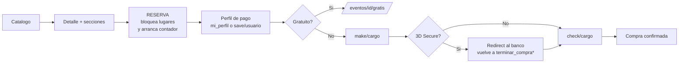

# API del frontend TaquillaVip — documentacion por flujos

Contrato de **los 102 endpoints que consume este frontend**, organizado por flujo de negocio.
Cada documento lleva la secuencia de llamadas, el body de peticion y el body de respuesta con
los campos que el front realmente lee.

> Extraido del codigo de `main_v2`. Cuando un campo aparece aqui es porque **algun componente
> lo consume**: si el backend lo quita, algo se rompe.

---

## Indice

| # | Documento | Cubre |
|---|---|---|
| 00 | [Convenciones](./00-convenciones.md) | Base URL, headers, refresh de token, formato de error, fechas |
| 01 | [Bootstrap / Configuracion](./01-bootstrap-configuracion.md) | Colores de marca, logo, footer, favicon, legales |
| 02 | [Autenticacion](./02-autenticacion.md) | OTP, tokens, sesion, OAuth, recuperar password |
| 03 | [Catalogo de eventos](./03-catalogo-eventos.md) | Home, slugs, detalle de evento, secciones |
| 04 | [Pagos y promociones](./04-pagos-openpay.md) | **Capa compartida**: OpenPay, tarjetas, promos, `amount`, 3DS |
| 05 | [Compra generales](./05-compra-generales.md) | Boletos por cantidad |
| 06 | [Compra numerados](./06-compra-numerados.md) | Mapa de asientos |
| 07 | [Abonos](./07-abonos.md) | Paquetes de temporada multi-funcion |
| 08 | [Conferencias](./08-conferencias.md) | Micrositio cosmotech y registro multipart |
| 09 | [Perfil y boletos](./09-perfil-boletos.md) | Datos, mis compras, wallet, QR dinamico |
| 10 | [Transferencias y amigos](./10-transferencias-amigos.md) | Enviar boletos a un amigo |
| 11 | [CityPass](./11-citypass.md) | Paquetes de atracciones |
| 12 | [Explorar / Reels](./12-explorar-reels.md) | Feed vertical de contenido, likes, vistas, filtros |
| 13 | [Meta Ads](./13-meta-ads.md) | **Capa transversal**: Pixel multi-pixel + Conversions API, campo `meta` |

**Los flujos 05, 06, 07, 08 y 11 dependen del 04.** Leelo primero.

**El flujo 13 se monta encima de 01, 03, 05, 06, 07, 08 y 11**: no agrega endpoints, agrega el
campo `meta` a peticiones y respuestas que ya existen.

---

## El patron de compra (comun a todos los flujos)

Los cinco flujos de compra siguen la misma forma; cambian el endpoint de reserva,
el de cargo y el de confirmacion. La tabla comparativa esta en
[flujo 04, seccion 4.6](./04-pagos-openpay.md#46-matriz-de-endpoints-de-cargo).

---

## Inventario completo de endpoints

Base: `VITE_URL_BACKEND + /api/v1`. **Auth** = requiere `Authorization: Bearer`.
`x-api-key` va en todas.

### Configuracion

| Metodo | Ruta | Auth | Flujo |
|---|---|---|---|
| GET | `/configuraciones/detail/1` | no | [01](./01-bootstrap-configuracion.md) |

### Autenticacion

| Metodo | Ruta | Auth | Flujo |
|---|---|---|---|
| GET | `/auth/otp/metodos-activos` | no | [02](./02-autenticacion.md) |
| POST | `/auth/otp/send` | no | 02 |
| POST | `/auth/otp/resend` | no | 02 |
| POST | `/auth/otp/validate` | no | 02 |
| PATCH | `/auth/otp/update` | **si** | 02 |
| GET | `/auth/get-reset-token` | **si** | 02 |
| POST | `/auth/refresh-token` | no (header removido) | 02 |
| GET | `/auth/check-status` | **si** | 02 |
| POST | `/auth/login` | no | 02 · *sin UI activa* |
| POST | `/auth/register` | no | 02 · *ruta comentada* |
| GET | `/auth/oauth2/get-actives` | no | 02 · *sin consumidores* |
| GET | `/auth/oauth2/get-public-keys` | no | 02 · *sin consumidores* |
| POST | `/auth/google` | no | 02 · *sin consumidores* |
| POST | `/auth/apple/verify` | no | 02 · *sin consumidores* |

### Correos

| Metodo | Ruta | Auth | Estado |
|---|---|---|---|
| POST | `/correos/send-verification-email/{email}` | no | vivo (registro) |
| POST | `/correos/forgot-password/{email}` | no | vivo |
| POST | `/correos/sold-tickets-email/{email}/{ticketId}` | si | vivo en abonos y detalle; comentado en numerados |
| POST | `/correos/sold-tickets-email-invitado/{invitadoId}/{ticketId}` | no | vivo en abonos y detalle |
| POST | `/correos/sold-tickets-email-invitado-conferencia/{invitadoId}/{ticketId}` | no | vivo |
| POST | `/correos/sold-tickets-email-3d/{ticketId}` | si | **comentado en todas partes** |

### Catalogo de eventos

| Metodo | Ruta | Auth | Flujo |
|---|---|---|---|
| GET | `/eventos/get_all_select?tipoDispositivo=web` | no | [03](./03-catalogo-eventos.md) |
| GET | `/eventos/slug/{slug}` | no | 03 |
| GET | `/eventos/{id}/detalle` | no | 03 |
| GET | `/eventos/{id}/detalle_seccion/false/web/{funcion}` | no | 03 |
| GET | `/eventos/{idEvento}/{idSeccion}/filas_por_seccion[/{funcionId}]` | no | [06](./06-compra-numerados.md) |
| GET | `/categorias/get_all` | no | 03 |
| GET | `/ciudades/get_all_ciudades` | no | 03 |
| GET | `/abonos/evento/{id}` | **si** | 03 |
| GET | `/abonos/{id}` | no | [07](./07-abonos.md) |

### Contenido / reels

| Metodo | Ruta | Auth | Flujo |
|---|---|---|---|
| GET | `/contenido/publico/feed` | no | [12](./12-explorar-reels.md) |
| GET | `/contenido/publico/feed/contadores` | no | [12](./12-explorar-reels.md) |
| GET | `/contenido/publico/feed/precios` | no | [12](./12-explorar-reels.md) |
| GET | `/contenido/publico/{id}` | no | [12](./12-explorar-reels.md) · *sin consumidores* |
| POST | `/contenido/publico/estado-likes` | **si** | [12](./12-explorar-reels.md) |
| POST | `/contenido/publico/{id}/like` | **si** | [12](./12-explorar-reels.md) |
| POST | `/contenido/publico/{id}/vista` | no | [12](./12-explorar-reels.md) |

### Reservas

| Metodo | Ruta | Auth | Flujo |
|---|---|---|---|
| POST | `/eventos/{eventoId}/reservar_generales` | **si** | [05](./05-compra-generales.md), [08](./08-conferencias.md) |
| POST | `/eventos/{eventoId}/reservar` | **si** | [06](./06-compra-numerados.md) |
| POST | `/abonos/{abonoId}/reservar` | **si** | [07](./07-abonos.md) |
| POST | `/eventos/{eventoId}/cancelar` | si | 05, 06, 07, 08 |
| POST | `/eventos/{eventoId}/gratis` | si | 05, 06, 07 |
| POST | `/eventos/{eventoId}/vender` | si | *sin consumidores* |

### Pagos — perfil y tarjetas

| Metodo | Ruta | Auth | Flujo |
|---|---|---|---|
| GET | `/pagos/get/credenciales` | no | [04](./04-pagos-openpay.md) |
| GET | `/pagos/get/mi_perfil` | **si** | 04 |
| POST | `/pagos/save/usuario` | **si** | 04 |
| POST | `/pagos/save/tarjeta` | **si** | 04 |
| DELETE | `/pagos/tarjeta/{clienteId}/{tarjetaId}` | **si** | 04 |

### Pagos — cargos

| Metodo | Ruta | Auth | Flujo |
|---|---|---|---|
| POST | `/pagos/make/cargo` | **si** | [05](./05-compra-generales.md), [06](./06-compra-numerados.md) |
| POST | `/pagos/check/cargo/{transaccionId}` | **si** | 05, 06 |
| POST | `/pagos/make/cargo_abono` | **si** | [07](./07-abonos.md) |
| POST | `/pagos/check/cargo_abono/{transaccionId}` | **si** | 07 · **sin body** |
| POST | `/pagos/make/conferencia/cargo` | **si** | [08](./08-conferencias.md) · **multipart** |
| POST | `/pagos/check/conferencia/cargo/{invitadoId}/{transaccionId}` | **si** | 08 |
| POST | `/pagos/check/conferencia/cargo/gratis/{invitadoId}` | **si** | 08 |
| POST | `/pagos/citypass/make/cargo` | **si** | [11](./11-citypass.md) |
| POST | `/pagos/citypass/check/cargo/{transaccionId}` | **si** | 11 · **sin body** |

### Promociones

| Metodo | Ruta | Auth | Flujo |
|---|---|---|---|
| POST | `/promociones/validar_promo_web` | no | [04](./04-pagos-openpay.md) |
| POST | `/promociones/validar_clave_web` | no | 04 |
| POST | `/pagos/aplicar-promo` | **si** | 04 |

### Conferencias

| Metodo | Ruta | Auth | Flujo |
|---|---|---|---|
| GET | `/eventos/conferencia/detalle/{eventoId}` | no | [08](./08-conferencias.md) |
| GET | `/eventos/conferencia/programa/{eventoId}` | no | 08 |
| GET | `/eventos/conferencia/speakers/{eventoId}` | no | 08 |
| GET | `/eventos/conferencia/hoteles/{eventoId}` | no | 08 |
| GET | `/eventos/conferencia/recinto/{eventoId}` | no | 08 |
| GET | `/eventos/conferencia/{eventoId}` | no | 08 · *codigo muerto* |

### Perfil y boletos

| Metodo | Ruta | Auth | Flujo |
|---|---|---|---|
| GET | `/usuarios/mi_perfil` | **si** | [09](./09-perfil-boletos.md) |
| PATCH | `/usuarios/update/perfil` | **si** | 09 · dos payloads distintos |
| PATCH | `/usuarios/update/profile-pic` | **si** | 09 · **multipart** |
| GET | `/eventos/mis_eventos` | **si** | 09 |
| GET | `/eventos/mis_eventos/{id}?funcionId=` | **si** | 09 |
| GET | `/boletos/mis` | **si** | 09 · *sin consumidores* |
| GET | `/wallet/is-active` | **si** | 09 |
| GET | `/wallet/google-ticket` | **si** | 09 |
| GET | `/wallet/apple-ticket` | **sin headers** | 09 · navegacion directa |
| GET | `/dynamic-qr/seed` | **si** | 09 |

### Transferencias y amigos

| Metodo | Ruta | Auth | Flujo |
|---|---|---|---|
| POST | `/transferencias` | **si** | [10](./10-transferencias-amigos.md) |
| POST | `/transferencias/devolver` | **si** | 10 |
| PATCH | `/transferencias/{id}` | **si** | 10 |
| GET | `/transferencias/pendientes/recibidas` | **si** | 10 · polling 30 s |
| GET | `/transferencias/pendientes/enviadas` | **si** | 10 · polling 30 s |
| GET | `/transferencias/enviadas` | **si** | 10 · *sin consumidores* |
| GET | `/transferencias/recibidas` | **si** | 10 · *sin consumidores* |
| GET | `/transferencias/boleto/{tipo}/{boletoId}` | **si** | 10 · *sin consumidores* |
| POST | `/amigos/solicitudes` | **si** | 10 |
| GET | `/amigos/solicitudes/recibidas` | **si** | 10 · polling 30 s |
| GET | `/amigos/solicitudes/enviadas` | **si** | 10 |
| PATCH | `/amigos/solicitudes/{id}` | **si** | 10 |
| GET | `/amigos` | **si** | 10 |
| DELETE | `/amigos/{friendshipId}` | **si** | 10 |

### CityPass

| Metodo | Ruta | Auth | Flujo |
|---|---|---|---|
| GET | `/citypass/publico/landing?ciudadId=` | no | [11](./11-citypass.md) |
| GET | `/citypass/publico/paquete/{id}` | no | 11 |
| GET | `/citypass/publico/mis-compras` | **si** | 11 |
| GET | `/citypass/publico/mis-compras/{id}` | **si** | 11 |
| GET | `/citypass/publico/mis-boletos` | **si** | 11 · *sin consumidores* |
| POST | `/citypass/transferencias` | **si** | 11 |
| PATCH | `/citypass/transferencias/{id}` | **si** | 11 |
| POST | `/citypass/transferencias/devolver` | **si** | 11 |
| GET | `/citypass/transferencias/enviadas` | **si** | 11 |
| GET | `/citypass/transferencias/recibidas` | **si** | 11 |
| GET | `/citypass/transferencias/pendientes/enviadas` | **si** | 11 · polling 30 s |
| GET | `/citypass/transferencias/pendientes/recibidas` | **si** | 11 · polling 30 s |
